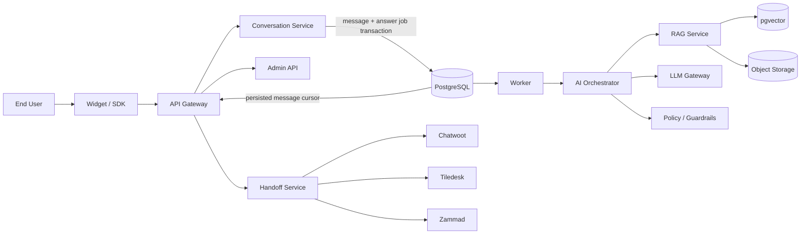
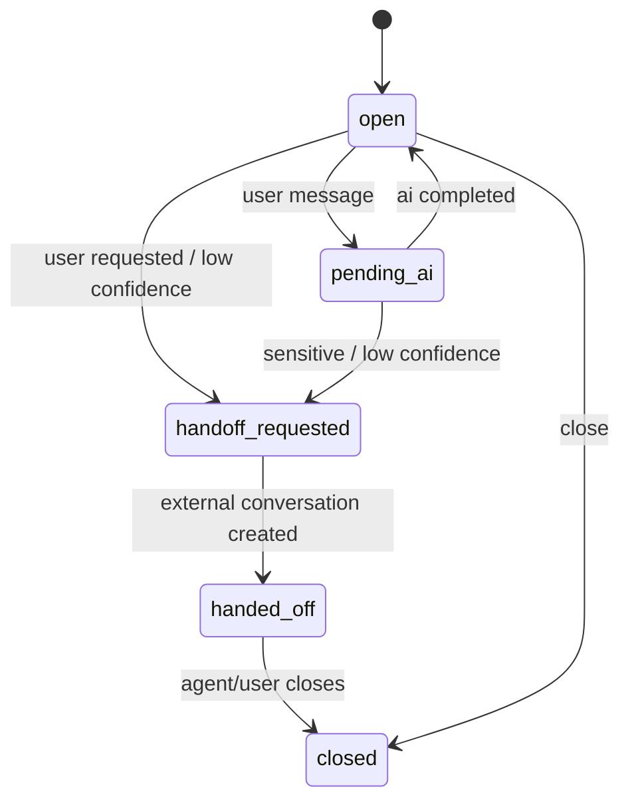
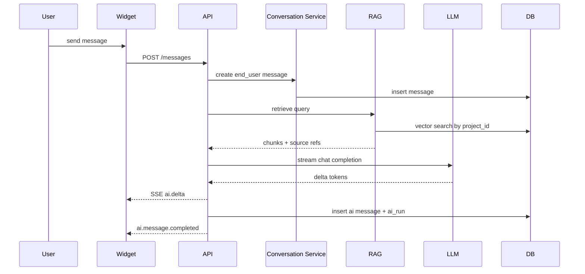
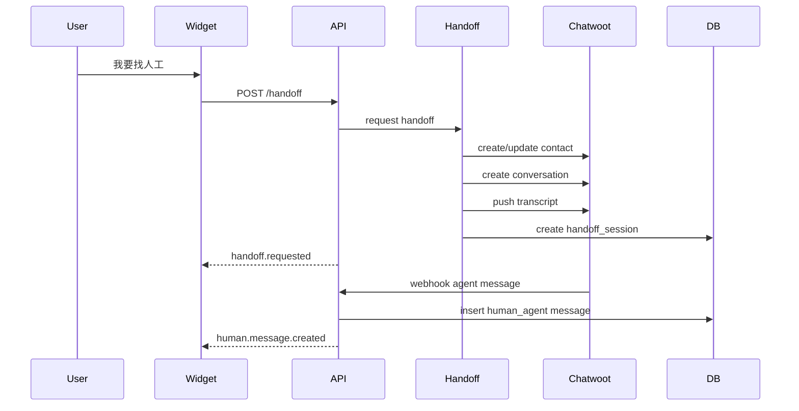

# OpenSupportAI 架构设计

## 架构目标

OpenSupportAI 的架构目标是构建一个轻量、可嵌入、可替换、可观测的 AI 客服运行时。

关键原则：

```text
API-first
Headless-first
Adapter-first
RAG-first
Human-in-the-loop
Observable-by-default
Tenant-isolated
```

---

## 总体架构



---

## 逻辑层

### 接入层

- Web Widget
- Headless JS SDK
- Admin Console
- Webhook receiver

### 核心服务层

- Conversation Service
- AI Orchestrator
- Knowledge Service
- Handoff Service
- Integration Config Service
- Event Service

### 基础设施层

- PostgreSQL
- pgvector
- Redis
- Object Storage
- LLM Provider
- External Helpdesk

---

## Conversation Service

Conversation Service 是客服系统事实源。

### 职责

```text
contact 管理
conversation 生命周期
message 与 answer job 事务写入
conversation 状态机
SSE event 广播与持久化消息补拉
handoff 触发
worker 驱动 AI orchestrator
```

### 状态机



---

## AI Orchestrator

AI Orchestrator 是一条可控管线，而不是自由 Agent。

```text
input message
→ normalize
→ detect handoff intent
→ detect risk intent
→ retrieve knowledge
→ check retrieval confidence
→ build prompt
→ stream LLM response
→ persist answer
→ write ai_run
→ emit events
```

### v0.1 不做

```text
多步 Agent planning
自主调用高风险工具
复杂 workflow builder
长期记忆系统
```

---

## Knowledge Service

Knowledge Service 由以下子模块组成：

```text
source connector
parser
cleaner
chunker
embedding client
vector store
retriever
source ref builder
```

v0.1 使用 PostgreSQL + pgvector。未来通过 adapter 支持：

```text
Qdrant
OpenSearch
Elasticsearch
RAGFlow
```

---

## LLM Gateway

LLM Gateway 对外只暴露统一接口：

```ts
interface ChatModel {
  generate(input: ChatRequest): Promise<ChatResponse>;
  stream(input: ChatRequest): AsyncIterable<ChatChunk>;
}

interface EmbeddingModel {
  embed(texts: string[]): Promise<number[][]>;
}
```

v0.1 支持 OpenAI-compatible API。

---

## Handoff Service

Handoff Service 不依赖具体客服平台，而依赖 adapter contract。

```ts
interface HandoffAdapter {
  provider: string;
  createOrUpdateContact(input: CreateContactInput): Promise<ExternalContactRef>;
  createConversation(input: CreateConversationInput): Promise<ExternalConversationRef>;
  pushMessage(input: PushMessageInput): Promise<void>;
  handleWebhook(input: WebhookInput): Promise<void>;
}
```

v0.1 首先实现 Chatwoot。

---

## Event Service

事件用于连接 API、Widget、worker 和外部 webhook。

### 内部事件

```text
conversation.created
message.created
ai.response.started
ai.response.delta
ai.response.completed
ai.response.failed
handoff.requested
handoff.completed
human.message.created
conversation.closed
```

### 客户端 SSE 事件

```text
message.created
ai.delta
ai.message.completed
handoff.requested
human.message.created
conversation.status_changed
error
```

---

## 多租户边界

核心边界：

```text
Organization
  └── Project
        ├── Inbox
        ├── Contact
        ├── Conversation
        ├── Knowledge
        ├── LLM Provider
        └── Integration Config
```

每个 Project 拥有独立：

```text
public key
LLM config
knowledge namespace
integration config
api keys
conversation data
```

所有查询必须强制 project_id。

---

## 数据流：AI 回答



---

## 数据流：人工转接



---

## 可替换点

| 能力          | v0.1 默认         | 后续替换                                   |
| ------------- | ----------------- | ------------------------------------------ |
| LLM           | OpenAI-compatible | LiteLLM, Anthropic adapter, Gemini adapter |
| Embedding     | OpenAI-compatible | local embedding, bge, jina                 |
| Vector        | pgvector          | Qdrant, OpenSearch, RAGFlow                |
| Handoff       | Chatwoot          | Tiledesk, Zammad, Slack, Webhook           |
| Realtime      | SSE               | WebSocket                                  |
| Observability | ai_runs           | Langfuse, OpenTelemetry                    |

---

## 架构决策记录

### ADR-001：v0.1 使用 TypeScript monorepo

理由：减少跨语言复杂度，提升 SDK、Widget、API 类型共享效率。

### ADR-002：v0.1 使用 SSE

理由：AI 流式回复和客服事件以 server-to-client 为主，SSE 简单稳定。

### ADR-003：Chatwoot 作为 adapter，不作为核心数据库

理由：避免强绑定客服台，保持核心组件可替换。

### ADR-004：RAG 无命中不回答

理由：客服场景中误答成本高于拒答成本。

### ADR-005：所有 AI 调用必须记录 ai_run

理由：AI 客服必须可审计、可评估、可调试。
